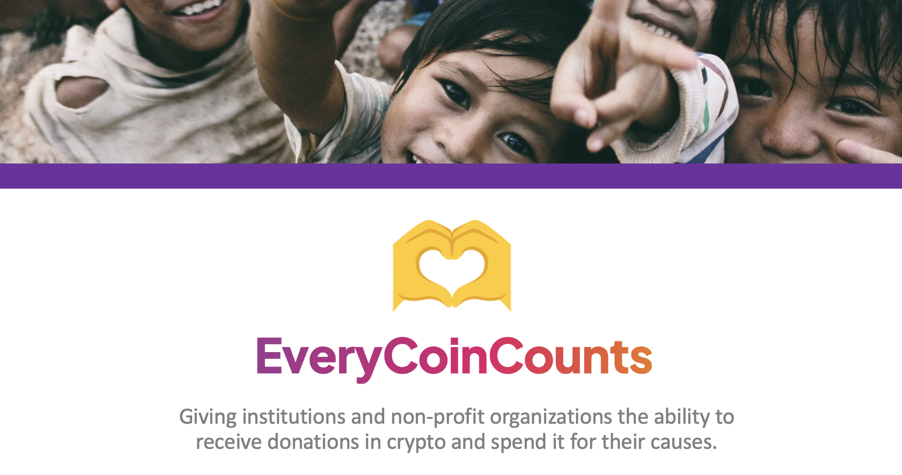

## Outline of The Problem ⚠️

Give institutions and non-profit organizations the ability to receive donations in crypto, and spend it for their causes.

## The Solution 🔮

An Open Source Code to support institutions and non-profit organizations to do good and help important causes by providing access to the Web3 space.
A blockchain solution that also offers a safe platform for donators to contribute to serious projects that impacts people's lives and can change histories.

## How it Works👷🏻

Using smart contract deployed on the most relevant networks like Ethereum and Polygon, we use oracles to verify entities credibility, offer crypto custody to institutions, and track the use of the founds raised.

We rely on UMA Optimistic Oracle (https://umaproject.org/) as our decentralized truth machine regulated by their community to validate institutions so donators can be sure that their contributions are spent appropriately and supporting the right causes.

# How to get started
Donators can deposit any value in the institution that works with the cause. The UMA community will audit the use of the funds.

## Developers 🧑🏻‍💻

Name  | Git Hub | LinkedIn | Twitter
------------- | ------------- | ------------- | -------------
Alexandre Rapchan B. Barros  | [@AleRapchan](https://www.github.com/AleRapchan) | [Alexandre-rapchan](https://www.linkedin.com/in/alexandre-rapchan/) | [@rapchan](https://www.twitter.com/rapchan/)
Alexei Pancratov  | [@AlexeiPancratov](https://www.github.com/alexeipancratov) | [Alexei-pancratov](https://www.linkedin.com/in/alexei-pancratov-07413b119/) | 

## Support

For support, please send an email to blockchain@alexandrebarros.com.
	
## Revisions
Date  |  Revision  |  Description  |  Author
--------  |  --------  |  --------  |  --------	
11/04/2022  |  `0.1`  |  First Draft  |  Rapchan and Pancratov
11/05/2022  |  `0.2`  |  Final Review  |  Rapchan and Pancratov

## Links 🌐
- [UMA Optimistic Oracle](http://umaproject.org/)
- [Remix Ethereum IDE](https://remix.ethereum.org/)
- [ETH San Francisco](https://sf.ethglobal.com/)

## MIT License ⚖️

Copyright (c) 2021 Rapchan and Pancratov

Permission is hereby granted, free of charge, to any person obtaining a copy
of this software and associated documentation files (the "Software"), to deal
in the Software without restriction, including without limitation the rights
to use, copy, modify, merge, publish, distribute, sublicense, and/or sell
copies of the Software, and to permit persons to whom the Software is
furnished to do so, subject to the following conditions:

The above copyright notice and this permission notice shall be included in all
copies or substantial portions of the Software.

THE SOFTWARE IS PROVIDED "AS IS", WITHOUT WARRANTY OF ANY KIND, EXPRESS OR
IMPLIED, INCLUDING BUT NOT LIMITED TO THE WARRANTIES OF MERCHANTABILITY,
FITNESS FOR A PARTICULAR PURPOSE AND NONINFRINGEMENT. IN NO EVENT SHALL THE
AUTHORS OR COPYRIGHT HOLDERS BE LIABLE FOR ANY CLAIM, DAMAGES OR OTHER
LIABILITY, WHETHER IN AN ACTION OF CONTRACT, TORT OR OTHERWISE, ARISING FROM,
OUT OF OR IN CONNECTION WITH THE SOFTWARE OR THE USE OR OTHER DEALINGS IN THE
SOFTWARE.
